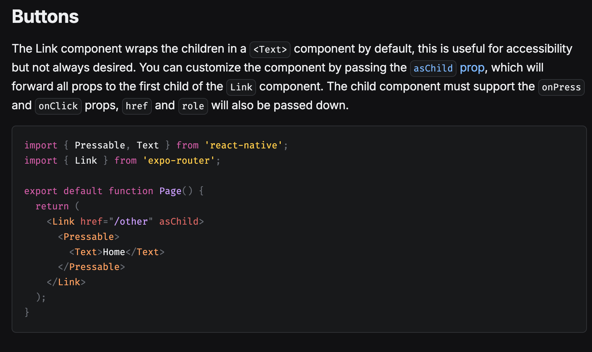

# Expo Router vs React Navigation Guide

This guide explores the transition from React Navigation to Expo Router, highlighting the key differences, advantages, and parameter handling approaches.

## Introduction

### What is React Navigation?

React Navigation is a standalone library that provides routing and navigation functionality for React Native apps([1](https://reactnavigation.org/docs/getting-started)). It offers:

- Multiple navigation patterns (Stack, Tab, Drawer)
- Cross-platform support
- Customizable navigation UI
- Deep linking capabilities

### What is Expo Router?

Expo Router is a file-based routing system built on top of React Navigation([2](https://docs.expo.dev/router/introduction/)). Key features include:

- File-system based routing
- Automatic deep linking
- Native platform optimization
- Offline-first functionality
- Universal routing across platforms
- SEO-friendly with static rendering for web

## Why Consider Switching?

### Advantages of Expo Router

1. **Simplified Routing**
   - File-based routing eliminates manual route configuration
   - More intuitive for developers familiar with Next.js or similar frameworks
   - Automatic deep linking for all routes

2. **Performance**
   - Routes are automatically optimized with lazy loading
   - Built-in route caching
   - Faster development iterations with universal Fast Refresh

3. **Developer Experience**
   - Less boilerplate code
   - Unified routing structure across platforms
   - Better TypeScript integration
   - Automatic static optimization for web

### Potential Drawbacks

1. **Learning Curve**
   - New mental model for routing
   - Different approach to navigation patterns
   - Limited documentation compared to React Navigation

2. **Flexibility**
   - Less control over navigation configuration
   - Tied to Expo ecosystem
   - May require directory restructuring in existing projects

## Parameter Handling

One of the key differences between React Navigation and Expo Router is how they handle navigation parameters. Let's explore both approaches:

### React Navigation Parameters
```javascript
// Navigation
navigation.navigate('UserProfile', { userId: 123 });

// Accessing params
const { userId } = route.params;
```

### Expo Router Parameters
```javascript
// Navigation
router.push('/user/123');

// Dynamic routes using [param].js
// app/user/[id].js
import { useLocalSearchParams } from 'expo-router';
export default function UserProfile() {
const { id } = useLocalSearchParams();
// id = 123
}
```

## Next Steps

This repository will explore practical examples of parameter handling in Expo Router, including:

- Dynamic route parameters
- Query parameters
- Deep linking with parameters
- Type-safe parameter handling
- State management integration



